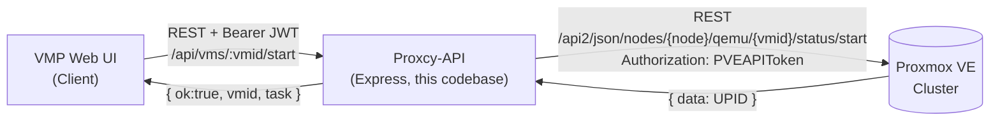
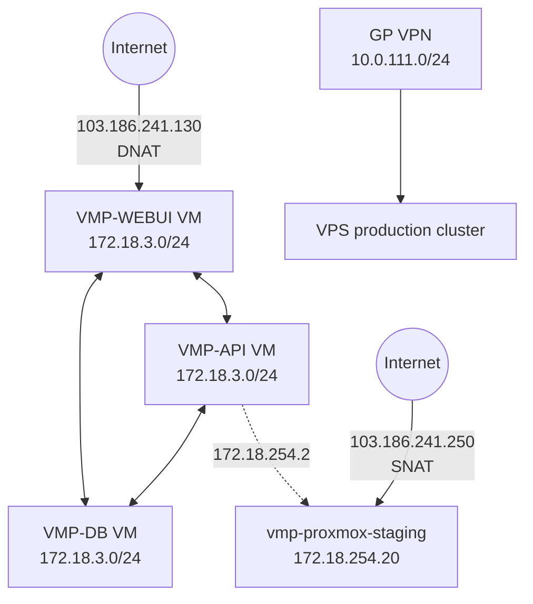
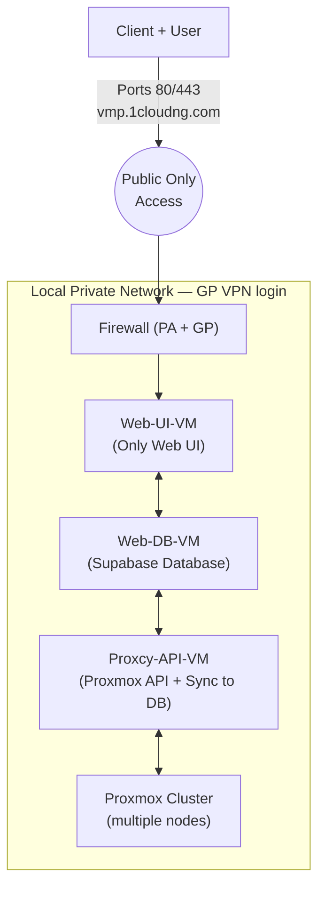
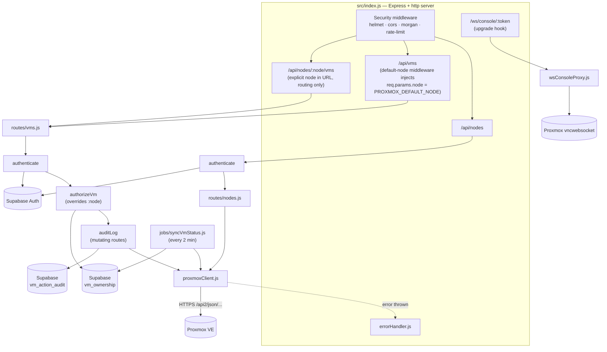
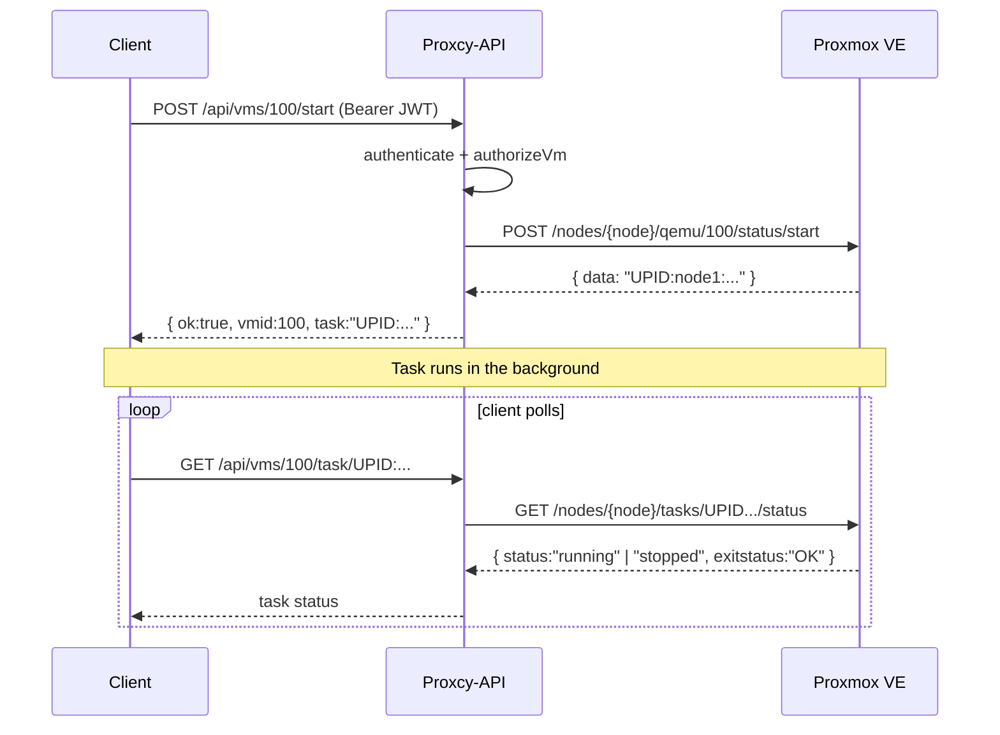
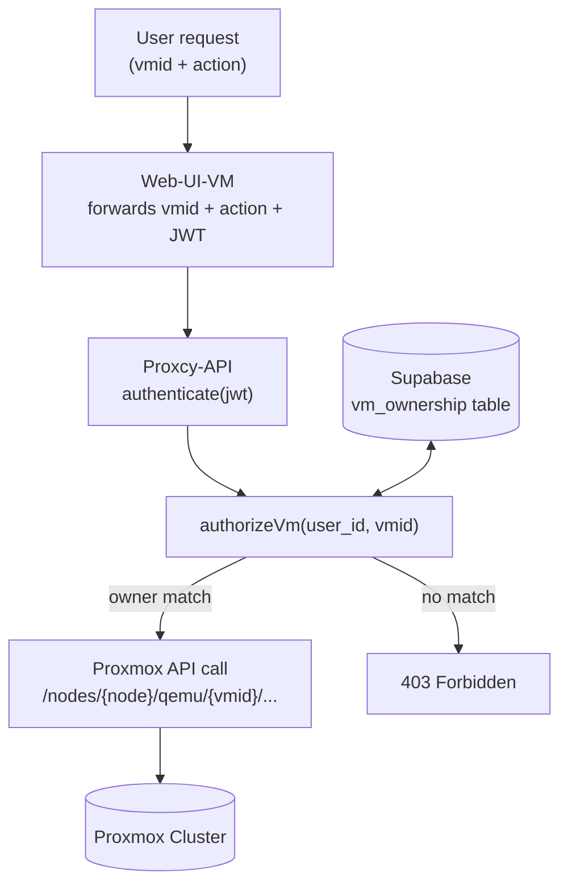
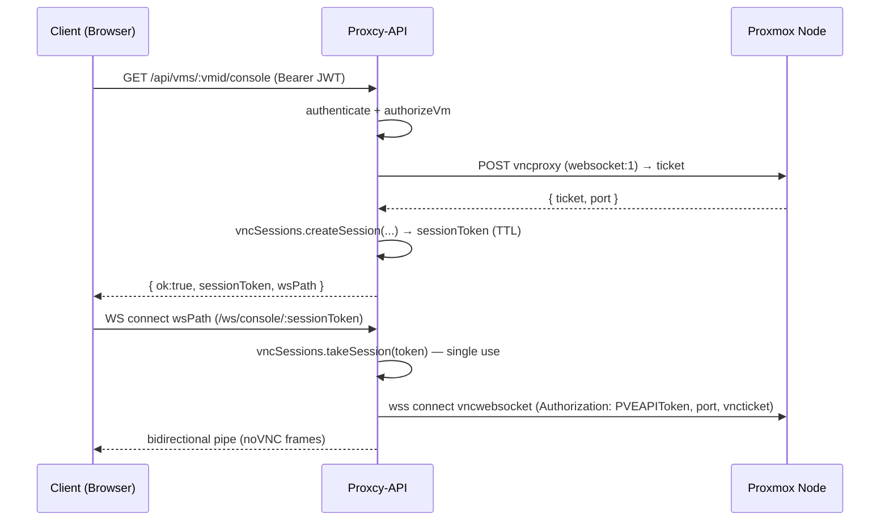

# Proxcy-API ↔ Proxmox VE — Architecture & Request Flow

**1CNG — Virtual Management Platform (VMP) Portal**
Proxmox VE + Supabase + Proxcy-API (Node.js / Express)

## Part A — Current Architecture

### A1. Big Picture

Proxcy-API is the wrapper/shield between the VMP Web UI and Proxmox VE. Two
layers:

1. **Proxcy-API** — this codebase (`index.js`, `routes/`, `middleware/`,
   `proxmoxClient.js`, `supabaseClient.js`, `errorHandler.js`). It accepts
   simple REST requests from the client, authenticates and authorizes them,
   and hides Proxmox VE's own API shape behind a consistent JSON contract.
2. **Proxmox VE** — the real `/api2/json/...` REST API that actually runs
   VM/node status queries, power operations, VNC tickets, etc.



### A2. Network Layer

- Public entry point — `103.186.241.130` DNAT-forwards into the internal
  `172.18.3.0/24` network, to the VMP-WEBUI VM.
- That `/24` subnet hosts three VMs: `VPS-...-361-VMP-WEBUI`,
  `-362-VMP-API`, `-363-VMP-DB`.
- Internal admin/staff access the production cluster over GlobalProtect VPN
  (`10.0.111.0/24`).
- `172.18.254.0/24` connects to the `vmp-proxmox-staging` node
  (`172.18.254.20`).



### A3. Application / Access-Flow Layer



This layered network design (public → Web-UI-VM → private services →
Proxmox) is architecturally sound on its own. The gap this repo previously
had was not network segmentation — it was that the **application layer**
carried no notion of "which customer owns which VM." That gap is closed by
Part B below.

### A4. Proxcy-API — Internal Structure

| File | Role |
|---|---|
| `src/index.js` | Express + `http` server entry point. Security middleware (helmet, cors, morgan, rate-limit), route mounting (`/api/nodes`, `/api/vms`, `/api/nodes/:node/vms`), the `/ws/console/*` upgrade hook, error handler, and starting the VM status sync job. |
| `src/proxmoxClient.js` | Axios instance for Proxmox VE — self-signed cert allowed, `PVEAPIToken` header attached, response/error normalized. |
| `src/supabaseClient.js` | Service-role Supabase client used by auth, authorization, audit logging, and the sync job. Bypasses RLS — authorization is enforced in code, not relied on from RLS alone. |
| `src/middleware/authenticate.js` | Verifies `Authorization: Bearer <jwt>` against Supabase Auth, attaches `req.user`. |
| `src/middleware/authorizeVm.js` | Looks up `vm_ownership` for `req.user.id` + `:vmid`; 403s if no match; overwrites `req.params.node` with the DB's node (never trusts the client-supplied node). |
| `src/middleware/requireAdmin.js` | Gates destructive, cluster-wide actions (VM destroy) behind `app_metadata.role === "admin"`. |
| `src/middleware/auditLog.js` | Wraps `res.json` to insert one `vm_action_audit` row per action, without blocking or failing the response if logging fails. |
| `src/vncSessions.js` | In-memory, TTL'd map from an opaque session token to `{ node, vmid, port, ticket }`. Single-process only. |
| `src/wsConsoleProxy.js` | Handles `/ws/console/:token` upgrades; proxies to Proxmox's `vncwebsocket` endpoint so the browser never sees the Proxmox host, port, or ticket. |
| `src/jobs/syncVmStatus.js` | Cron (every 2 minutes) that refreshes `node` / `status_cache` in `vm_ownership` from `/cluster/resources` — never touches `user_id`. |
| `src/routes/nodes.js` | `GET /api/nodes`, `GET /api/nodes/:node` — both behind `authenticate`. |
| `src/routes/vms.js` | All VM (QEMU) operations — see Part A5 and Part B4. |
| `src/errorHandler.js` | Terminal error middleware — converts any error into `{ ok:false, error, path }` with the right status. |

### Component Diagram



### Default node vs. specific node routing

`index.js` mounts the same `vms` router twice:

```javascript
// Default node route — injects PROXMOX_DEFAULT_NODE before the vms router runs
app.use("/api/vms", (req, res, next) => {
  req.params.node = process.env.PROXMOX_DEFAULT_NODE || "node1";
  next();
}, vmsRouter);

// Specific node route — :node comes from the URL
app.use("/api/nodes/:node/vms", vmsRouter);
```

`vmsRouter` is created with `{ mergeParams: true }`, so its handlers read
`req.params.node` regardless of which mount point supplied it. **This value
is only used to route the request to this proxy** — `authorizeVm`
subsequently overwrites `req.params.node` with the node recorded in
`vm_ownership` before any Proxmox call is made, so a client cannot redirect
an action to a different node by editing the URL.

- `POST /api/vms/100/start` → default node's vmid 100, if the caller owns it
- `POST /api/nodes/node1/vms/100/start` → same authorization check; the real
  target node still comes from `vm_ownership`, not from `node1` in the URL

### A5. Proxmox VE Part — Endpoint Mapping

| Proxcy-API endpoint | Method | Proxmox VE API (`/api2/json/...`) | Notes |
|---|---|---|---|
| `/api/nodes` | GET | `/nodes` | All nodes in the cluster |
| `/api/nodes/:node` | GET | `/nodes/{node}/status` | CPU/RAM/uptime for one node |
| `/api/vms` | GET | `/nodes/{node}/qemu/{vmid}/status/current` per owned VM | Caller's owned VMs only — never a raw node-wide list |
| `/api/vms/:vmid` | GET | `/nodes/{node}/qemu/{vmid}/status/current` + `/config` (parallel) | Status + config fetched together |
| `/api/vms/:vmid/start` | POST | `/nodes/{node}/qemu/{vmid}/status/start` | Returns a task UPID |
| `/api/vms/:vmid/stop` | POST | `/nodes/{node}/qemu/{vmid}/status/stop` | Force stop (abrupt power cut) |
| `/api/vms/:vmid/shutdown` | POST | `/nodes/{node}/qemu/{vmid}/status/shutdown` | Graceful shutdown (ACPI) |
| `/api/vms/:vmid/reboot` | POST | `/nodes/{node}/qemu/{vmid}/status/reboot` | Reboot |
| `/api/vms/:vmid` | DELETE | `/nodes/{node}/qemu/{vmid}` | Permanent destroy — **admin role required** |
| `/api/vms/:vmid/stats` | GET | `/nodes/{node}/qemu/{vmid}/rrddata` | Historical CPU/RAM/Disk/Net data |
| `/api/vms/:vmid/console` | GET | `/nodes/{node}/qemu/{vmid}/vncproxy` | Returns a session token, not the raw ticket |
| `/api/vms/:vmid/task/:upid` | GET | `/nodes/{node}/tasks/{upid}/status` | Poll an async action's status |

### Why the task/UPID pattern?

Power operations are asynchronous on the Proxmox side: the API accepts the
request and immediately returns a **UPID**, while the operation runs in the
background. The client polls `GET /api/vms/:vmid/task/:upid` for completion.



### Console (VNC) flow

See Part B4.4 below — the console endpoint no longer returns a raw Proxmox
ticket/host; it returns an opaque session token and a websocket path that
Proxcy-API itself proxies.

### A6. Code Notes

**`cleanVmid` helper (`src/utils/vmid.js`)** — strips a leading `:` from
`vmid` before it's used. Normal Express routing doesn't require a literal
colon in a path param, so this is a defensive workaround for a client that
was, at some point, sending vmid as `:100`. If you control that client,
fixing the source is preferable to relying on this indefinitely.

**Empty-response handling (`proxmoxClient.js`)** — some Proxmox actions
return an empty body on success; the response interceptor normalizes that
to `{ data: null }` rather than letting callers deal with an empty string.

## Part B — Multi-Tenant Authorization (Implemented)

### B1. Problem

Proxmox VE's own access-control system (RBAC) only understands
Proxmox-native users/tokens/pools — it has no concept of a VMP "customer_id"
or "user_id." Authorization therefore has to live entirely in Proxcy-API.
Before this change:

- **No authentication** — any caller could hit any route.
- **No authorization (ownership check)** — `/api/vms/:vmid` endpoints
  passed `vmid` straight through to Proxmox; one user editing the URL could
  reach another user's VM (IDOR).
- **Console/VNC leaked the Proxmox host** — the ticket, port, and Proxmox
  host address were returned directly to the client.
- **DELETE (VM destroy) had no protection** at all.
- **CORS fallback was a wildcard** when `ALLOWED_ORIGINS` was unset.
- **Rate limiting was global/IP-based only** — no per-user limiting.
- **No audit trail** of who did what to which VM and when.

### B2. Solution — Overview

Proxmox is never trusted with tenant identity; the trust boundary is
Proxcy-API itself. Three layers, all implemented in `src/middleware/` and
`src/routes/vms.js`:

1. **Authentication** — the Web-UI forwards the Supabase Auth access token
   as `Authorization: Bearer <jwt>`; `authenticate` verifies it against
   Supabase.
2. **Authorization** — `authorizeVm` reads `user_id` off the verified JWT
   and cross-checks `:vmid` against the `vm_ownership` table before any
   request reaches Proxmox.
3. **Least privilege** — `PROXMOX_TOKEN` should be scoped to VM lifecycle
   operations only (`VM.Audit`, `VM.PowerMgmt`, `VM.Console`), not
   `root@pam` — see `.env.example`.



### B3. Supabase Schema

Defined in [supabase/schema.sql](supabase/schema.sql) — apply it to the
Supabase project referenced by `SUPABASE_URL`.

#### `vm_ownership`

| Column | Type | Notes |
|---|---|---|
| id | uuid (PK) | `gen_random_uuid()` |
| user_id | uuid (FK → auth.users.id) | VM owner |
| customer_id | text | Reuse the existing system's customer_id |
| vmid | integer | Proxmox VMID (unique per node) |
| node | text | Proxmox node the VM lives on |
| pmx_type | text | `qemu` or `lxc` |
| status_cache | text | Kept fresh by `jobs/syncVmStatus.js`, for list rendering only |
| created_at / updated_at | timestamptz | |

Row Level Security is enabled with a `select`-only policy for
`auth.uid() = user_id`. There is deliberately no insert/update/delete policy
for the `authenticated` role — only the service-role key (used by your
provisioning workflow and by `syncVmStatus.js`) may write to this table.
Proxcy-API itself connects with the service-role key, so RLS is a backstop
here, not the primary control — `authorizeVm` is.

#### `vm_action_audit`

One row per start/stop/shutdown/reboot/delete/console action: `user_id`,
`vmid`, `node`, `action`, `result` (`success`/`error`), `ip_address`,
`created_at`. Written by `src/middleware/auditLog.js`.

### B4. Request-Level Enforcement

| Route | Middleware chain |
|---|---|
| `GET /api/nodes`, `GET /api/nodes/:node` | `authenticate` |
| `GET /api/vms` | `authenticate` (filters to the caller's owned VMs) |
| `GET /api/vms/:vmid`, `/stats`, `/task/:upid` | `authenticate` → `authorizeVm` |
| `POST /api/vms/:vmid/{start,stop,shutdown,reboot}` | `authenticate` → `authorizeVm` → `auditLog(action)` |
| `GET /api/vms/:vmid/console` | `authenticate` → `authorizeVm` → `auditLog("console")` |
| `DELETE /api/vms/:vmid` | `authenticate` → `authorizeVm` → `requireAdmin` → `auditLog("delete")` |

`authorizeVm` always runs before the Proxmox call is made and always
overwrites `req.params.node`, so the node segment in a URL can never be used
to redirect an action to a VM/node the caller doesn't own.

### B4.1 Console / VNC — Redesigned Flow



The Proxmox host, port, and ticket are never sent to the browser — only an
opaque, single-use session token and a same-origin websocket path. See
`src/vncSessions.js` (TTL store) and `src/wsConsoleProxy.js` (the actual
proxy, wired into `src/index.js` via the HTTP server's `upgrade` event).

### B4.2 VM Inventory Sync Job

`src/jobs/syncVmStatus.js` runs every 2 minutes, reads
`/cluster/resources?type=vm` from Proxmox, and updates `node` /
`status_cache` per `vmid` in `vm_ownership`. It never writes `user_id` —
ownership is set only by your provisioning/billing workflow via the
service-role key.

### B5. Security Checklist

- [x] Every VM route (except the owned-VM list) runs `authenticate` +
      `authorizeVm`.
- [x] The client-supplied node parameter is never trusted for the actual
      Proxmox call.
- [x] `DELETE` (VM destroy) requires `authenticate` + `authorizeVm` +
      `requireAdmin`.
- [x] Console/VNC never returns the raw Proxmox ticket or host address.
- [x] Every mutating action is written to `vm_action_audit`.
- [ ] Set `ALLOWED_ORIGINS` to your real production domain(s) in every
      deployed environment — the wildcard fallback exists for local dev only.
- [ ] Create the Proxmox API token as a least-privilege user (e.g.
      `proxcy-api@pve`), not `root@pam`.
- [ ] Add per-user (not just per-IP) rate limiting if abuse from a single
      authenticated account becomes a concern.
- [ ] Swap `vncSessions.js`'s in-memory map for Redis (or similar) before
      running more than one Proxcy-API instance.
- [ ] Revisit the `cleanVmid` workaround's root cause (a client sending
      `:vmid`) on the Web-UI side.

### B6. Testing & Validation

| Test case | Expected |
|---|---|
| User A starts a VM they own | 200 ok |
| User A starts a VM owned by User B (vmid edited in the URL) | 403 Forbidden |
| Request with no `Authorization` header | 401 Unauthorized |
| Expired/invalid JWT | 401 Unauthorized |
| Client edits the `:node` segment of the URL | Ignored — `authorizeVm` still resolves the DB's node |
| Inspect the console response/network tab | No Proxmox host/port/ticket visible, only `sessionToken` + `wsPath` |
| `DELETE /api/vms/:vmid` with a non-admin token | 403 Forbidden |
| Rapid repeated requests | 429 Too Many Requests once the rate limit is hit |

### B7. Deployment Checklist

1. Apply `supabase/schema.sql` to the target Supabase project.
2. Confirm RLS is enabled on `vm_ownership` (schema file does this).
3. Create a least-privilege Proxmox API token and update `PROXMOX_TOKEN`.
4. Set `SUPABASE_URL` / `SUPABASE_SERVICE_ROLE_KEY` / `ALLOWED_ORIGINS` for
   the target environment and restart the service.
5. Test against the staging cluster (`172.18.254.20`) before touching
   production.
6. Update any Postman/API-client collections for the new `Authorization:
   Bearer` requirement and the changed console response shape.
7. Keep `vm_action_audit` around as access-control evidence for compliance
   reviews (e.g. ISO 27001).

## References

- Supabase Docs — https://supabase.com/docs
- Supabase Auth — server-side JWT verification — https://supabase.com/docs/reference/javascript/auth-getuser
- Supabase Row Level Security — https://supabase.com/docs/guides/auth/row-level-security
- Proxmox VE API Viewer — https://pve.proxmox.com/pve-docs/api-viewer/
- Proxmox VE User & Permission Management (pveum) — https://pve.proxmox.com/pve-docs/pve-admin-guide.html#pveum
