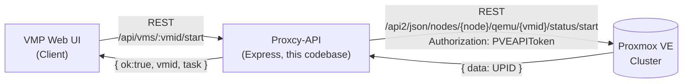
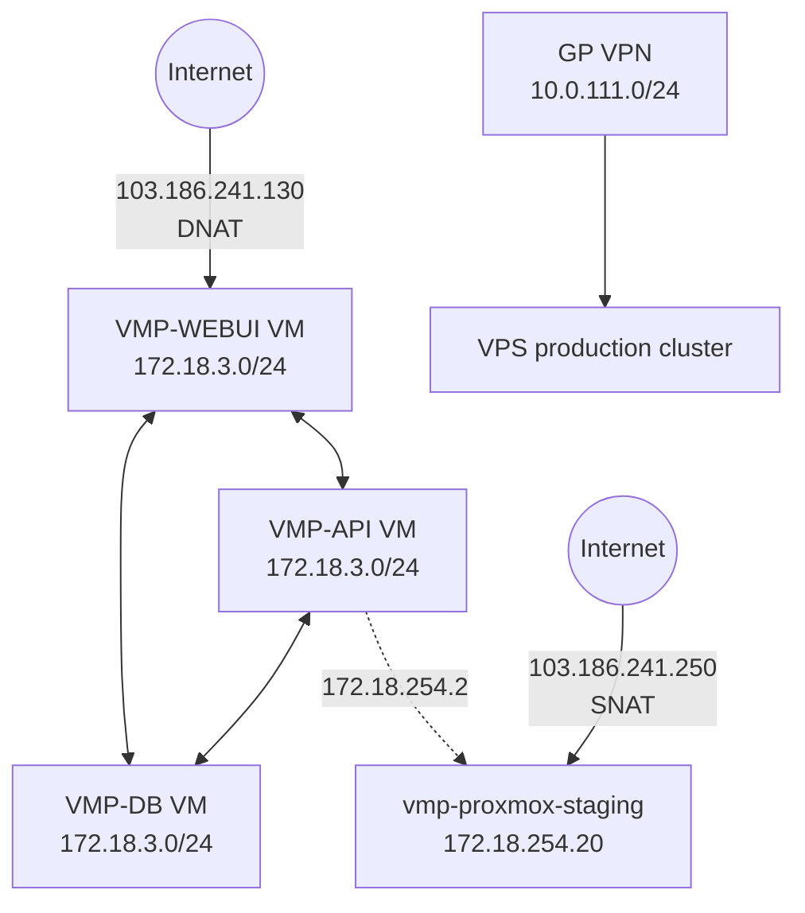
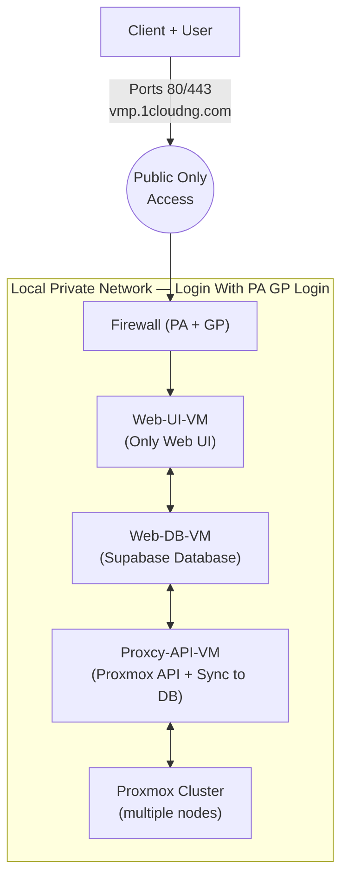
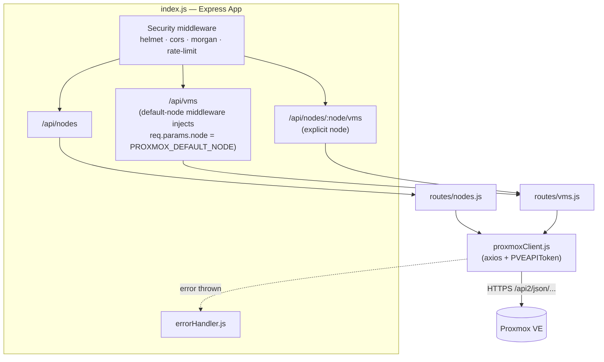
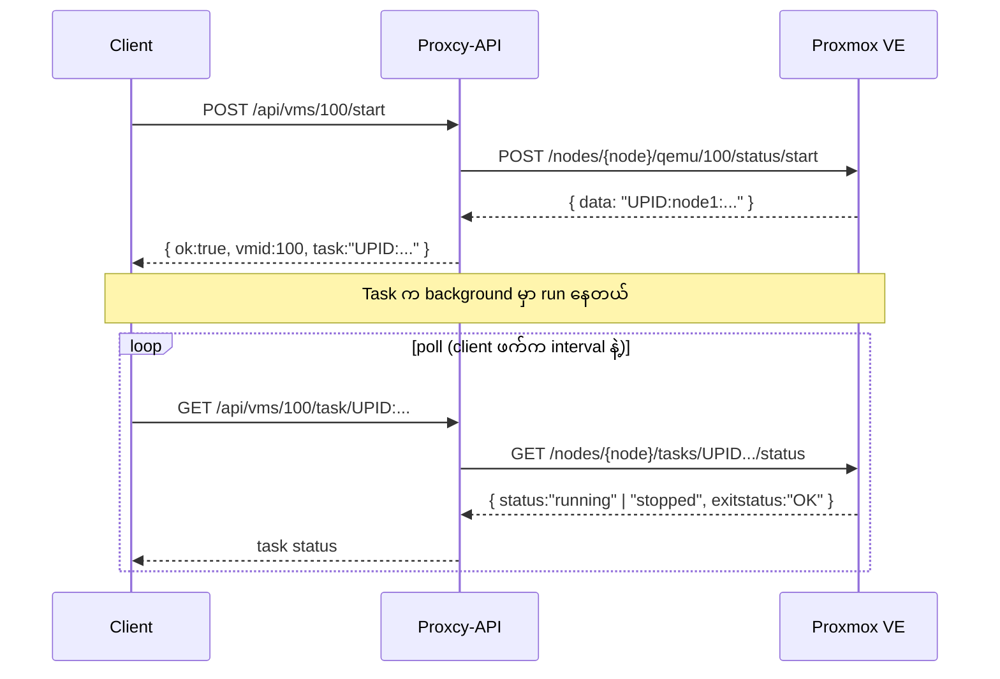
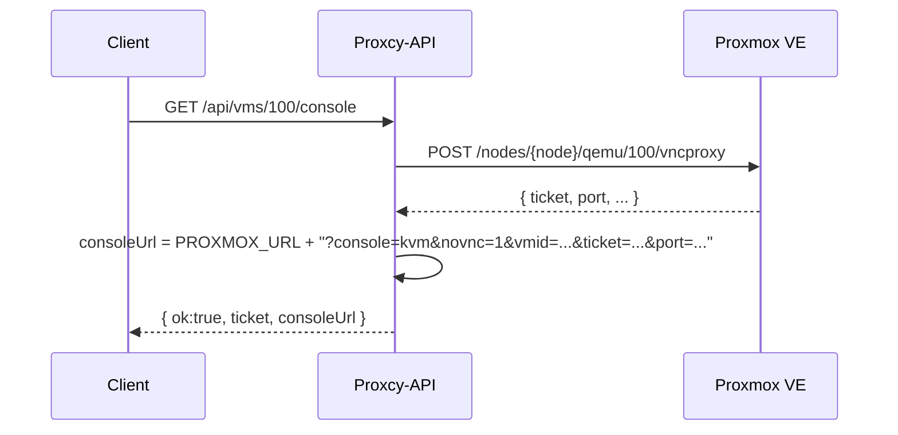
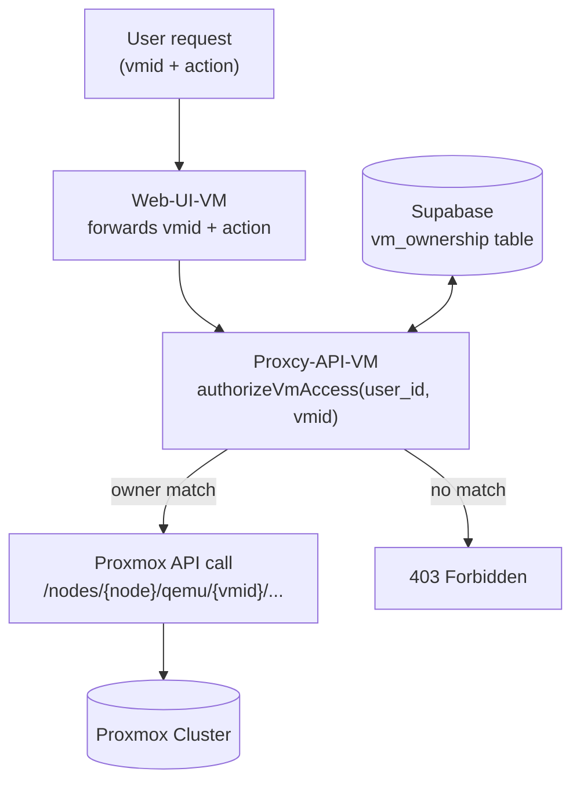
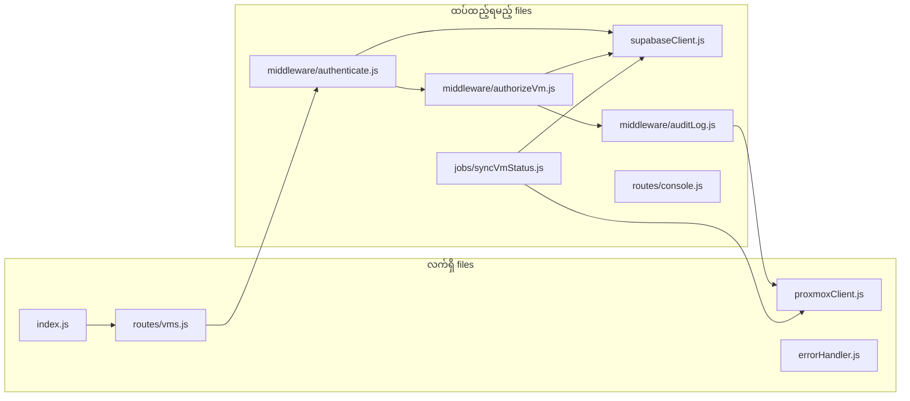
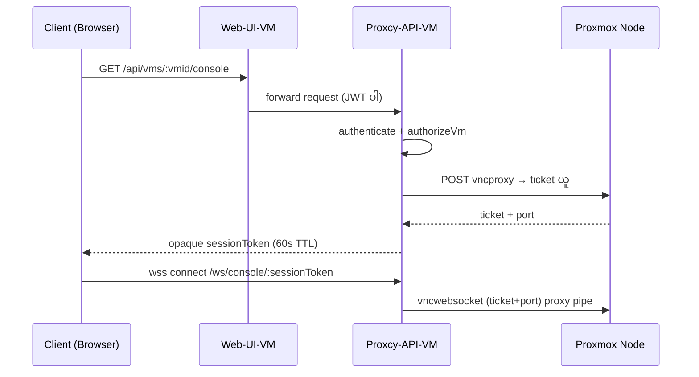

# VMP Proxcy-API — Architecture, Gap Analysis & Multi-Tenant Authorization Guide

**1CNG — Virtual Management Platform (VMP) Portal**

Proxmox VE + Supabase + Proxcy-API (Node.js/Express)

# A — လက်ရှိ Architecture ဘယ်လိုအလုပ်လုပ်လဲ

## A1. Big Picture — Layer ( 2 )

Proxcy-API ဆိုတာ VMP Web UI နဲ့ Proxmox VE ကြားက **wrapper/shield** ဖြစ်ပါတယ်။ layer နှစ်ခု ရှိပါတယ် —

1. **Proxcy-API part** — သင် ရေးထားတဲ့ Express.js app (`index.js`, `routes/`, `proxmoxClient.js`, `errorHandler.js`) — client ကနေ simple REST request လက်ခံပြီး Proxmox VE ရဲ့ ရှုပ်ထွေးတဲ့ API format ကို hide ထားပေးတယ်
2. **Proxmox VE part** — Proxmox ရဲ့ actual `/api2/json/...` REST API — VM/node status, power operations, VNC ticket စသည်တို့ကို ကိုင်တွယ်တဲ့ engine ကိုယ်တိုင်



## A2. Network Layer ( infra diagram )

- Public entry point — `103.186.241.130` ကနေ DNAT ဖြင့် internal `172.18.3.0/24` network ထဲက VMP-WEBUI VM ဆီကို forward လုပ်ပါတယ်
- `172.18.3.0/24` subnet ထဲမှာ VPS-TDC-00000-361-VMP-WEBUI, -362-VMP-API, -363-VMP-DB VM သုံးလုံး ရှိပါတယ်
- GP (GlobalProtect VPN) `10.0.111.0/24` ကနေတစ်ဆင့် internal admin/staff တွေက VPS production cluster ကို access လုပ်ပါတယ်
- `172.18.254.0/24` subnet ကနေ vmp-proxmox-staging node (`172.18.254.20`) ကို ချိတ်ဆက်ထားပါတယ်



## A3. Application / Access-Flow Layer



ဒီ layered network design (public → Web-UI-VM → private services → Proxmox) ကိုယ်တိုင်က architecture အနေနဲ့ မှန်ကန်ပါတယ်။ ပြသနာက network segmentation မဟုတ်ဘဲ — application layer (Proxcy-API code) ထဲမှာ customer ownership ကို စစ်ဆေးတဲ့ logic လုံးဝ မရှိသေးတာ ဖြစ်ပါတယ် (အပိုင်း B မှာ အသေးစိတ်)။

## A4. Proxcy-API Part — Internal Structure

### File ( Analysis Code Based )

| File | Role |
|---|---|
| `index.js` | Express app entry point — security middleware (helmet, cors, morgan, rate-limit) စီစဉ်ခြင်း, route mount ခြင်း (`/api/nodes`, `/api/vms`, `/api/nodes/:node/vms`), error handler တပ်ဆင်ခြင်း |
| `proxmoxClient.js` | Proxmox VE ကို ချိတ်ဆက်ဖို့ axios instance တစ်ခု — self-signed cert allow, `PVEAPIToken` header ထည့်ခြင်း, response/error normalize လုပ်ခြင်း |
| `routes/nodes.js` | Node list + node status endpoint (`/api/nodes`, `/api/nodes/:node`) |
| `routes/vms.js` | VM operations အားလုံး (list, status, start/stop/shutdown/reboot, delete, stats, console, task-status) |
| `errorHandler.js` | Central error handler — route ထဲက `next(err)` ကနေ ရောက်လာတဲ့ error ကို consistent JSON format ပြောင်းပေးတယ် |

### Component Diagram



### Route resolution ရဲ့ node logic

`index.js` ထဲမှာ route mount နှစ်ခု ရှိတာ သတိပြုပါ —

```javascript
// Default node route — PROXMOX_DEFAULT_NODE ကို အလိုအလျောက် ထည့်ပေးတယ်
app.use("/api/vms", (req, res, next) => {
  req.params.node = process.env.PROXMOX_DEFAULT_NODE || "node1";
  next();
}, vmsRouter);

// Specific node route — client က node name ကို url ထဲ ကိုယ်တိုင် ဖော်ပြရတယ်
app.use("/api/nodes/:node/vms", vmsRouter);
```

ဒါကြောင့် endpoint နှစ်မျိုး ရှိတယ် —

- `POST /api/vms/100/start` → `PROXMOX_DEFAULT_NODE` ပေါ်က vmid 100 ကို start
- `POST /api/nodes/node1/vms/100/start` → node1 ပေါ်က vmid 100 ကို start

## A5. Proxmox VE Part — Endpoint Mapping

Proxcy-API endpoint တစ်ခုချင်းစီက Proxmox VE ရဲ့ ဘယ် real API endpoint ကို ခေါ်တယ်ဆိုတာ အသေးစိတ် —

| Proxcy-API endpoint | Method | Proxmox VE API (`/api2/json/...`) | ရှင်းလင်းချက် |
|---|---|---|---|
| `/api/nodes` | GET | `/nodes` | Cluster ထဲက node အားလုံး list |
| `/api/nodes/:node` | GET | `/nodes/{node}/status` | Node တစ်ခုချင်းစီရဲ့ CPU/RAM/uptime |
| `/api/vms` (or `/api/nodes/:node/vms`) | GET | `/nodes/{node}/qemu` | Node ပေါ်က VM (qemu) အားလုံး list |
| `/api/vms/:vmid` | GET | `/nodes/{node}/qemu/{vmid}/status/current` + `/config` (parallel) | VM status + config နှစ်ခုစလုံး တစ်ပြိုင်နက် ယူတယ် |
| `/api/vms/:vmid/start` | POST | `/nodes/{node}/qemu/{vmid}/status/start` | VM start — Proxmox က task UPID ပြန်ပေးတယ် |
| `/api/vms/:vmid/stop` | POST | `/nodes/{node}/qemu/{vmid}/status/stop` | Force stop (power cut — abrupt) |
| `/api/vms/:vmid/shutdown` | POST | `/nodes/{node}/qemu/{vmid}/status/shutdown` | Graceful shutdown (ACPI signal) |
| `/api/vms/:vmid/reboot` | POST | `/nodes/{node}/qemu/{vmid}/status/reboot` | Reboot |
| `/api/vms/:vmid` | DELETE | `/nodes/{node}/qemu/{vmid}` | VM ကို permanent destroy — **destructive, irreversible** |
| `/api/vms/:vmid/stats` | GET | `/nodes/{node}/qemu/{vmid}/rrddata` | CPU/RAM/Disk/Network historical graph data |
| `/api/vms/:vmid/console` | GET | `/nodes/{node}/qemu/{vmid}/vncproxy` | VNC console session ဖွင့်ဖို့ ticket + port ယူတယ် |
| `/api/vms/:vmid/task/:upid` | GET | `/nodes/{node}/tasks/{upid}/status` | Async action (start/stop/reboot) ရဲ့ task status စစ်တယ် |

### Why Use Task/UPID pattern ?

Power operations (start/stop/shutdown/reboot/delete) အားလုံးက **synchronous မဟုတ်ပါဘူး**။ Proxmox က request ကို လက်ခံလိုက်ပြီး **UPID** ကို ချက်ချင်း ပြန်ပေးတယ် — အလုပ်က background မှာ run နေဆဲ။ Client ဘက်က `GET /api/vms/:vmid/task/:upid` ကို poll လုပ်ရပါမယ်။



### Console (VNC) flow — Currently



> ⚠ ဒီ flow ရဲ့ ပြဿနာက `consoleUrl` ထဲမှာ `PROXMOX_URL` (Proxmox host address) ကို client ဆီ တိုက်ရိုက် ထုတ်ပေးထားတာပါ — Proxmox host ဟာ private network ထဲမှာပဲ ရှိရင် public client (browser) က ဒီ URL ကို တိုက်ရိုက် ချိတ်လို့ ရမှာ မဟုတ်ပါဘူး။ Redesign နည်းကို **B8** မှာ ဖော်ပြထားပါတယ်။

## A6. Corrected Code Review — Finde 

**`cleanVmid` helper — `vmid.replace(/^:/, "")`**
`routes/vms.js` ထဲမှာ vmid ရဲ့ ရှေ့က `:` character ကို strip လုပ်နေတာ တွေ့ရပါတယ်:
```javascript
const cleanVmid = (vmid) => vmid.replace(/^:/, "");
```
ပုံမှန် Express routing မှာ `req.params.vmid` ဟာ literal colon ပါဖို့ မလိုပါဘူး။ ဒီ workaround ရှိနေတယ်ဆိုတာက တစ်နေရာရာမှာ client (Web-UI) က vmid ကို `:100` ပုံစံနဲ့ ကိုယ်တိုင် ပို့နေတာ ဖြစ်နိုင်ပါတယ် — root cause ကို client-side ဘက်မှာ ပြန်စစ်ဖို့ အကြံပြုပါတယ်၊ proxy layer ထဲမှာ workaround နဲ့ hide ထားလိုက်ရင် client bug ကို မမြင်ရဘဲ ဖုံးကွယ်ထားရာ ရောက်နိုင်ပါတယ်။

**Empty-response handling (`proxmoxClient.js`)**
```javascript
if (!res.data || res.data === '') {
  res.data = { data: null };
}
```
Proxmox VE ရဲ့ endpoint အချို့ (success ဖြစ်ပေမယ့် body မပါတဲ့ action) က empty string ပြန်ပေးတတ်လို့ ဒီ normalize logic လိုအပ်ပါတယ် — ကောင်းတဲ့ defensive fix ဖြစ်ပါတယ်။

**README ရဲ့ example requests**
Multi-node support example ကို ထည့်ထားတာက documentation quality ကောင်းလာပါတယ် — Postman collection ကိုပါ ဒီ pattern အတိုင်း sync ထားဖို့ အကြံပြုပါတယ်။

---

# အပိုင်း B — ပြင်ဖို့လိုအပ်တာ: Multi-Tenant Authorization

## B1. ပြဿနာ အသေးစိတ်ခွဲခြမ်းစိတ်ဖြာချက်

Proxmox VE ရဲ့ Access Control (RBAC) system ဟာ Proxmox-native users/tokens/pools ကိုပဲ သိပါတယ်။ "customer_id" ဒါမှမဟုတ် VMP ရဲ့ "user_id" ဆိုတဲ့ concept ကို Proxmox API level မှာ လုံးဝမသိပါဘူး — ဒါကြောင့် authorization decision အားလုံးကို Proxcy-API layer ထဲမှာပဲ implement လုပ်ရပါမယ်။ Corrected code ကို review လုပ်ကြည့်ရင်လည်း gap တွေ ဆက်ရှိနေပါတယ် —

**▸ Authentication လုံးဝမရှိ**
route တိုင်းက `req.params.vmid` ကို ဘယ် user ကမဆို ခေါ်ရင် ခေါ်နိုင်ပါတယ်။

**▸ Authorization (ownership check) လုံးဝမရှိ**
GET/POST/DELETE `/api/vms/:vmid` endpoint များအားလုံးက vmid ကို Proxmox ဆီ တိုက်ရိုက် pass-through လုပ်ပေးနေပါတယ်။ user A က user B ရဲ့ vmid ကို url ထဲမှာ ပြောင်းထည့်ရုံနဲ့ access ရနိုင်ပါတယ် (IDOR vulnerability)။

**▸ Console/VNC endpoint က Proxmox host ကို client ဆီ ဖော်ထုတ်ပေးနေတယ်**
(A5 မှာ ဖော်ပြပြီးသား — architecture ကို ဖောက်ဖျက်နေတဲ့ design flaw)

**▸ DELETE (VM destroy) endpoint ကို protection မရှိဘဲ ဖွင့်ထားတယ်**
Authentication/authorization/confirmation မရှိပဲ Proxmox ဆီ တိုက်ရိုက် destroy command ပို့ပါတယ်။

**▸ CORS fallback က wildcard ဖြစ်တတ်တယ်**
`ALLOWED_ORIGINS` env မထည့်ရင် `origin: "*"` ကျသွားပါတယ်။

**▸ Rate limit က global ဖြစ်နေတယ်**
IP-based/global အနေနဲ့ပဲ ချထားလို့ user-level abuse ကို ခွဲခြားမထိန်းနိုင်ပါဘူး။

**▸ Audit log မရှိ**
ဘယ် user က ဘယ် vmid ကို ဘယ်အချိန် action ဘာလုပ်လိုက်တယ်ဆိုတာ မှတ်တမ်းတင်ခြင်း လုံးဝမရှိပါဘူး — ISO 27001 access-control documentation အတွက်လည်း လိုအပ်ပါတယ်။

## B2. Solution Design — Overview

Proxmox ကို ဘယ်တော့မှ trust မလုပ်ပါနဲ့ — trust boundary ကို Proxcy-API layer ထဲမှာပဲ ချထားပါ။ Defense-in-depth layer သုံးထပ် —

1. **Authentication layer** — Web-UI-VM က user login လုပ်တဲ့အခါ Supabase Auth ကနေ ထုတ်ပေးတဲ့ JWT access token ကို Proxcy-API ဆီ `Authorization: Bearer` header နဲ့ ပို့ရပါမယ်
2. **Authorization layer** — Proxcy-API က JWT ကနေ user_id ကို ဖတ်ပြီး Supabase ထဲက `vm_ownership` table နဲ့ vmid ကို cross-check လုပ်မှသာ Proxmox ဆီ request ကို forward လုပ်ရပါမယ်
3. **Least-privilege layer** — Proxmox API token ကို VM lifecycle operations (start/stop/status/vncproxy) ပဲ scope ချထားပြီး user/storage/node-config permission လုံးဝ မပါစေရပါဘူး



## B3. Supabase Database Design

Reference: 🔗 https://supabase.com/docs/guides/database/overview · 🔗 https://supabase.com/docs/guides/auth/row-level-security

### `vm_ownership` Table

| Column | Type | Explained |
|---|---|---|
| id | uuid (PK) | `gen_random_uuid()` |
| user_id | uuid (FK → auth.users.id) | VM ကို ပိုင်ဆိုင်သူ |
| customer_id | text / uuid | လက်ရှိ system ထဲက customer_id ကို reuse |
| vmid | integer | Proxmox VMID (unique per node) |
| node | text | VM ရှိတဲ့ Proxmox node name |
| pmx_type | text | 'qemu' or 'lxc' |
| status_cache | text | sync job ကနေ update — UI list ပြဖို့သာ |
| created_at | timestamptz | default now() |
| updated_at | timestamptz | sync job/trigger ကနေ update |

```sql
create table public.vm_ownership (
  id uuid primary key default gen_random_uuid(),
  user_id uuid not null references auth.users(id) on delete cascade,
  customer_id text not null,
  vmid integer not null,
  node text not null,
  pmx_type text not null default 'qemu',
  status_cache text,
  created_at timestamptz not null default now(),
  updated_at timestamptz not null default now(),
  unique (node, vmid)
);

create index idx_vm_ownership_user on public.vm_ownership(user_id);
create index idx_vm_ownership_vmid on public.vm_ownership(vmid, node);
```

### Row Level Security (RLS)

Proxcy-API-VM ကတော့ `service_role` key နဲ့ operate လုပ်မှာမို့ RLS ကို bypass လုပ်ပါလိမ့်မယ် — ဒါကြောင့် authorization check ကို Proxcy-API code ထဲမှာ manual ထပ်ရေးရပါမယ် (RLS ကိုပဲ trust မလုပ်ပါနဲ့)။

```sql
alter table public.vm_ownership enable row level security;

create policy "Users can view own vm ownership"
  on public.vm_ownership for select
  using (auth.uid() = user_id);

-- INSERT / UPDATE / DELETE — service_role (Proxcy-API sync job) ကနေပဲ
-- လုပ်ရမယ်၊ authenticated user ဆီကို policy လုံးဝ မပေးပါနဲ့
```

> ⚠ `vm_ownership` row ကို customer ကိုယ်တိုင် INSERT/UPDATE/DELETE လုပ်ခွင့် ဘယ်တော့မှ မပေးပါနဲ့ — VM provisioning workflow (billing/order system) ကနေပဲ service_role key နဲ့ ownership record ကို ဖန်တီးသင့်ပါတယ်။

### `vm_action_audit` Table

```sql
create table public.vm_action_audit (
  id bigserial primary key,
  user_id uuid not null,
  vmid integer not null,
  node text not null,
  action text not null,       -- start | stop | shutdown | reboot | console
  result text not null,       -- success | denied | error
  ip_address text,
  created_at timestamptz not null default now()
);
```

## B4. Proxcy-API — Implementation Steps



### B4.1 Package Install

```bash
npm install @supabase/supabase-js
npm install ws http-proxy-middleware   # VNC websocket proxy အတွက်
npm install node-cron                  # sync job အတွက်
```

### B4.2 .env — Config အသစ်များ

```env
# --- Proxmox (လက်ရှိ) ---
PROXMOX_URL=https://YOUR_PROXMOX_IP:8006
PROXMOX_TOKEN=PVEAPIToken=proxcy-api@pve!vmp-token=YOUR_TOKEN_SECRET
PROXMOX_DEFAULT_NODE=node1
PORT=3000
ALLOWED_ORIGINS=https://vmp.1cloudng.com

# --- Supabase (အသစ်) ---
SUPABASE_URL=https://YOUR_PROJECT.supabase.co
SUPABASE_SERVICE_ROLE_KEY=YOUR_SERVICE_ROLE_KEY   # server-side ONLY

# --- VNC proxy (အသစ်) ---
VNC_TOKEN_TTL_SECONDS=60
```

> ⚠ `PROXMOX_TOKEN` ကို `root@pam` အစား limited-permission Proxmox user (ဥပမာ `proxcy-api@pve`) နဲ့ create လုပ်ပြီး `VM.Audit`, `VM.PowerMgmt`, `VM.Console` permission ပဲ pool အလိုက် assign ပါ။

### B4.3 `src/supabaseClient.js`

```javascript
const { createClient } = require("@supabase/supabase-js");

const supabaseAdmin = createClient(
  process.env.SUPABASE_URL,
  process.env.SUPABASE_SERVICE_ROLE_KEY,
  { auth: { autoRefreshToken: false, persistSession: false } }
);

module.exports = supabaseAdmin;
```

### B4.4 `src/middleware/authenticate.js`

```javascript
const supabaseAdmin = require("../supabaseClient");

async function authenticate(req, res, next) {
  try {
    const authHeader = req.headers.authorization || "";
    const token = authHeader.startsWith("Bearer ") ? authHeader.slice(7) : null;

    if (!token) {
      const err = new Error("Missing access token");
      err.status = 401;
      throw err;
    }

    const { data, error } = await supabaseAdmin.auth.getUser(token);
    if (error || !data?.user) {
      const err = new Error("Invalid or expired token");
      err.status = 401;
      throw err;
    }

    req.user = { id: data.user.id, email: data.user.email };
    next();
  } catch (err) {
    next(err);
  }
}

module.exports = authenticate;
```

### B4.5 `src/middleware/authorizeVm.js` (core)

```javascript
const supabaseAdmin = require("../supabaseClient");

async function authorizeVm(req, res, next) {
  try {
    const userId = req.user.id;
    const vmid = parseInt(req.params.vmid, 10);

    if (!Number.isInteger(vmid)) {
      const err = new Error("Invalid vmid");
      err.status = 400;
      throw err;
    }

    const { data, error } = await supabaseAdmin
      .from("vm_ownership")
      .select("vmid, node, customer_id")
      .eq("user_id", userId)
      .eq("vmid", vmid)
      .single();

    if (error || !data) {
      const err = new Error("Forbidden");
      err.status = 403;
      throw err;
    }

    // client ပေးလိုက်တဲ့ node param ကို trust မလုပ်ပါနဲ့ — DB owner record ကိုပဲ သုံးပါ
    req.params.node = data.node;
    req.vmOwnership = data;
    next();
  } catch (err) {
    next(err);
  }
}

module.exports = authorizeVm;
```

> ⚠ `req.params.node` ကို client-supplied value နဲ့ ဘယ်တော့မှ မယူပါနဲ့ — `authorizeVm` middleware ကနေ ပြန်ရလာတဲ့ DB record ကိုပဲ node value အဖြစ် override လုပ်ပါ။

### B4.6 `src/middleware/auditLog.js`

```javascript
const supabaseAdmin = require("../supabaseClient");

function auditLog(action) {
  return async (req, res, next) => {
    const originalJson = res.json.bind(res);
    res.json = (body) => {
      supabaseAdmin.from("vm_action_audit").insert({
        user_id: req.user?.id,
        vmid: parseInt(req.params.vmid, 10),
        node: req.params.node,
        action,
        result: body?.ok ? "success" : "error",
        ip_address: req.ip,
      }).then(() => {}).catch((e) => console.error("audit log failed", e));
      return originalJson(body);
    };
    next();
  };
}

module.exports = auditLog;
```

### B4.7 `src/routes/vms.js` — Update ပုံစံ

```javascript
const express = require("express");
const router = express.Router({ mergeParams: true });
const proxmox = require("../proxmoxClient");
const authenticate = require("../middleware/authenticate");
const authorizeVm = require("../middleware/authorizeVm");
const auditLog = require("../middleware/auditLog");

const node = (req) => req.params.node;
const cleanVmid = (vmid) => vmid.replace(/^:/, "");   // လက်ရှိ workaround ကို ဆက်ထားရင်

// user ပိုင်တဲ့ VM list ကိုပဲ ပြန်ပေးတယ်
router.get("/", authenticate, async (req, res, next) => {
  try {
    const supabaseAdmin = require("../supabaseClient");
    const { data: owned } = await supabaseAdmin
      .from("vm_ownership").select("vmid, node")
      .eq("user_id", req.user.id);

    const results = await Promise.all((owned || []).map((o) =>
      proxmox.get(`/nodes/${o.node}/qemu/${o.vmid}/status/current`)
        .then((r) => ({ vmid: o.vmid, node: o.node, ...r.data.data }))
    ));
    res.json({ ok: true, data: results });
  } catch (err) { next(err); }
});

router.get("/:vmid", authenticate, authorizeVm, async (req, res, next) => {
  try {
    const vmid = cleanVmid(req.params.vmid);
    const [status, config] = await Promise.all([
      proxmox.get(`/nodes/${node(req)}/qemu/${vmid}/status/current`),
      proxmox.get(`/nodes/${node(req)}/qemu/${vmid}/config`),
    ]);
    res.json({ ok: true, vmid, status: status.data.data, config: config.data.data });
  } catch (err) { next(err); }
});

router.post("/:vmid/start", authenticate, authorizeVm, auditLog("start"),
  async (req, res, next) => {
    try {
      const vmid = cleanVmid(req.params.vmid);
      const { data } = await proxmox.post(`/nodes/${node(req)}/qemu/${vmid}/status/start`, {});
      res.json({ ok: true, vmid, task: data.data });
    } catch (err) { next(err); }
  });

// stop / shutdown / reboot — pattern အတူတူပါပဲ
// (authenticate, authorizeVm, auditLog("<action>") ကို route တိုင်းမှာ ထည့်ပါ)

// DELETE — customer portal ကနေ လုံးဝ မဖွင့်ပါနဲ့ (B5 ကြည့်ပါ)

module.exports = router;
```

### B4.8 Console / VNC Flow — Redesign



1. Client က Web-UI-VM ကို `GET /api/vms/:vmid/console` ခေါ်တယ်
2. Web-UI-VM က Proxcy-API-VM ဆီ (JWT ပါတဲ့) forward လုပ်တယ်
3. Proxcy-API-VM က `authenticate` + `authorizeVm` ဖြတ်ပြီးမှသာ Proxmox ရဲ့ `vncproxy` API ကို ခေါ်ပြီး ticket ယူတယ်
4. Proxmox ticket ကို client ဆီ raw အနေနဲ့ ပြန်မပေးပါနဲ့ — short-lived (60s) session token ပဲ ထုတ်ပေးပါ
5. noVNC JS ရဲ့ websocket ကို Proxcy-API-VM ဆီပဲ ချိတ်ခိုင်းပါ — Proxcy-API က Proxmox node ဆီ websocket proxy (pipe) လုပ်ပေးပါ

```javascript
// src/routes/console.js
const { randomUUID } = require("crypto");
const proxmox = require("../proxmoxClient");

const sessions = new Map(); // in-memory; production မှာ Redis သုံးပါ

router.get("/:vmid/console", authenticate, authorizeVm, async (req, res, next) => {
  try {
    const vmid = cleanVmid(req.params.vmid);
    const { data } = await proxmox.post(`/nodes/${node(req)}/qemu/${vmid}/vncproxy`, { websocket: 1 });
    const ticket = data.data;

    const sessionToken = randomUUID();
    sessions.set(sessionToken, {
      node: node(req), vmid, port: ticket.port, ticket: ticket.ticket,
      expiresAt: Date.now() + (process.env.VNC_TOKEN_TTL_SECONDS || 60) * 1000,
    });

    // Proxmox host address/ticket ကို client ဆီ ဘယ်တော့မှ မထုတ်ရ
    res.json({ ok: true, sessionToken, wsPath: `/ws/console/${sessionToken}` });
  } catch (err) { next(err); }
});
```

> ⚠ Websocket pipe (Proxcy-API-VM → Proxmox `vncwebsocket`) ကို `ws` library နဲ့ implement လုပ်ရပါမယ် — staging environment (172.18.254.20) မှာ အရင်ဆုံး စမ်းသပ်ပါ။

### B4.9 VM Inventory Sync Job

```javascript
// src/jobs/syncVmStatus.js
const cron = require("node-cron");
const proxmox = require("../proxmoxClient");
const supabaseAdmin = require("../supabaseClient");

cron.schedule("*/2 * * * *", async () => {   // 2 မိနစ်တစ်ခါ
  const { data } = await proxmox.get("/cluster/resources", { params: { type: "vm" } });
  for (const vm of data.data) {
    await supabaseAdmin.from("vm_ownership")
      .update({ node: vm.node, status_cache: vm.status, updated_at: new Date() })
      .eq("vmid", vm.vmid);   // ownership (user_id) column ကို မထိပါ
  }
});
```

## B5. Security Checklist

- [ ] route အားလုံး (GET list မှလွဲပြီး) မှာ `authenticate` + `authorizeVm` middleware နှစ်ခုစလုံး run နေရမည်
- [ ] client ကနေ ပေးလိုက်တဲ့ node parameter ကို ဘယ်တော့မှ trust မလုပ်ပါနဲ့
- [ ] 403/404 error message ကို generic ထားပါ (vmid ရှိမရှိ မဖော်ပြပါနဲ့)
- [ ] DELETE endpoint ကို customer-facing API ကနေ လုံးဝ ဖယ်ထုတ်ပါ — admin-only tool သီးသန့်ကနေပဲ ခွင့်ပြုပါ
- [ ] console/VNC endpoint က Proxmox ticket/host address ကို client ဆီ raw အနေနဲ့ ဘယ်တော့မှ မပြန်ပါနဲ့
- [ ] `ALLOWED_ORIGINS` ကို VMP production domain အတိအကျပဲ ထည့်ပါ — wildcard fallback ကို remove ပါ
- [ ] Rate limit ကို global IP-based အပြင် user_id-based ပါ ထပ်ထည့်ပါ
- [ ] Proxmox API token ကို `root@pam` အစား least-privilege user နဲ့ create လုပ်ပါ
- [ ] `vm_ownership` table ကို customer ကိုယ်တိုင် INSERT/UPDATE/DELETE မလုပ်နိုင်အောင် RLS policy နဲ့ ပိတ်ပါ
- [ ] action အားလုံးကို `vm_action_audit` table ထဲ log လုပ်ပါ
- [ ] `SUPABASE_SERVICE_ROLE_KEY` ကို `.env`/`.gitignore` double-check လုပ်ပါ
- [ ] HTTPS ကို link နှစ်ခုစလုံးမှာ enforce လုပ်ပါ
- [ ] `cleanVmid` workaround ရဲ့ root cause (client က `:vmid` ပုံစံနဲ့ ပို့နေတာ) ကို Web-UI ဘက်မှာ ပြန်စစ်ပါ

## B6. Testing & Validation

| Test case | မျှော်လင့်ချက် |
|---|---|
| User A က User A ပိုင် vmid ကို start | 200 ok |
| User A က User B ပိုင် vmid ကို start (vmid ကို url ထဲ ပြောင်းထည့်) | 403 Forbidden |
| Token မပါဘဲ request ပို့ | 401 Unauthorized |
| Expired/invalid JWT ပို့ | 401 Unauthorized |
| Client ကနေ node parameter ကို manual ပြောင်းထည့် | authorizeVm ကနေ DB owner node ကို override လုပ်ရမည် |
| Console ticket ကို client ဆီ inspect (network tab) | Proxmox host IP/port/ticket မမြင်ရ |
| DELETE /api/vms/:vmid ကို customer token နဲ့ ခေါ် | 404/403 |
| Rate limit — short time ထဲ request အများကြီးပို့ | 429 Too Many Requests |

## B7. Deployment Checklist

1. Supabase project ထဲမှာ `vm_ownership`, `vm_action_audit` table နှစ်ခုကို create လုပ်ပါ
2. RLS policy ကို enable + apply လုပ်ပါ
3. Proxmox ဘက်မှာ least-privilege API token အသစ် create လုပ်ပါ
4. Proxcy-API-VM ရဲ့ `.env` ကို update လုပ်ပြီး service ကို restart လုပ်ပါ
5. Staging environment (172.18.254.20) မှာ အရင် test လုပ်ပါ၊ production cluster ကို မထိခင်
6. Postman collection ကို authenticate/authorizeVm flow အတွက် update လုပ်ပါ
7. Audit log table ကို ISO 27001 access-control evidence အဖြစ် document လုပ်ထားပါ

---

## References

- Supabase Documentation — https://supabase.com/docs
- Supabase Auth — Server-side JWT verification — https://supabase.com/docs/reference/javascript/auth-getuser
- Supabase Row Level Security — https://supabase.com/docs/guides/auth/row-level-security
- Proxmox VE API Viewer — https://pve.proxmox.com/pve-docs/api-viewer/
- Proxmox VE — vncproxy — https://pve.proxmox.com/pve-docs/api-viewer/#/nodes/{node}/qemu/{vmid}/vncproxy
- Proxmox VE — User & Permission Management (pveum) — https://pve.proxmox.com/pve-docs/pve-admin-guide.html#pveum