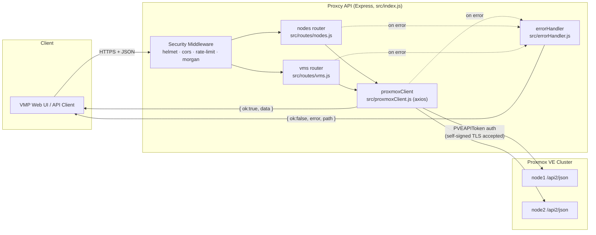
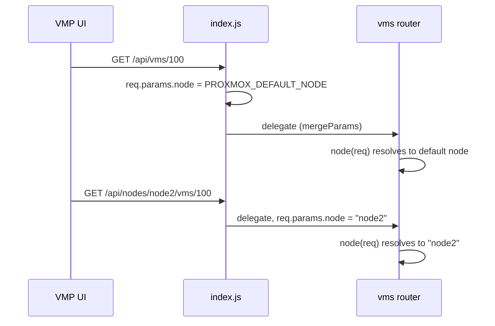
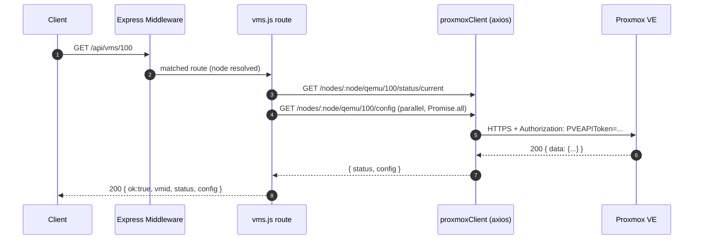
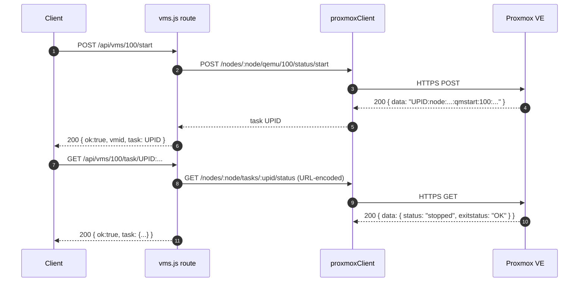
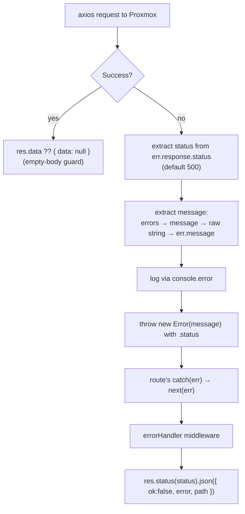

# Proxcy API ↔ Proxmox VE — Architecture & Request Flow

## 1. Purpose

Proxcy is a thin, stateless Express proxy that sits between the VMP web UI (or any
other client) and one or more Proxmox VE nodes. It exists so that:

- The Proxmox API token never reaches the browser — it lives only in the proxy's
  `.env` and is attached to outbound requests server-side.
- Proxmox's self-signed certificates, raw error shapes, and node-scoped URL
  structure are hidden behind a small, consistent JSON contract.
- The UI can talk to a single node ("default node" routes) without knowing the
  cluster topology, while still being able to address any node explicitly when
  it needs to (multi-node routes).

Proxcy does not persist any state of its own — every request is translated
1:1 into a Proxmox API call and the (normalized) result is streamed back.

## 2. High-Level Architecture



## 3. Components

| File | Responsibility |
|---|---|
| [src/index.js](src/index.js) | App bootstrap: security middleware stack, health check, route mounting (default-node vs. specific-node), error handler, server startup logging. |
| [src/proxmoxClient.js](src/proxmoxClient.js) | Single axios instance pre-configured with the Proxmox base URL, `PVEAPIToken` auth header, a relaxed TLS agent for self-signed certs, and a response interceptor that normalizes Proxmox errors into a plain `Error` with `.status`. |
| [src/routes/nodes.js](src/routes/nodes.js) | `GET /api/nodes` (cluster node list) and `GET /api/nodes/:node` (single node status). |
| [src/routes/vms.js](src/routes/vms.js) | All VM (QEMU) lifecycle operations: list, status+config, start/stop/shutdown/reboot, delete, stats, console ticket, task polling. Mounted twice — once under the default node, once under `/api/nodes/:node/vms` — via Express `mergeParams`. |
| [src/errorHandler.js](src/errorHandler.js) | Terminal Express error middleware. Converts any thrown/forwarded error into the standard `{ ok: false, error, path }` JSON response with the correct HTTP status. |

## 4. Middleware Pipeline (per request)

Every request to Proxcy passes through the same pipeline before it reaches a
route handler:

1. **`helmet()`** — sets hardened HTTP security headers.
2. **`express.json()`** — parses JSON request bodies.
3. **`morgan("dev")`** — request logging to stdout.
4. **`cors(...)`** — only origins listed in `ALLOWED_ORIGINS` (comma-separated)
   may call the API; falls back to `*` if unset. Only `GET`, `POST`, `DELETE`
   are permitted.
5. **`express-rate-limit`** — 100 requests / 60s per client, returning
   `{ ok: false, error: "Too many requests" }` once exceeded.
6. **Route matching** — see §5.
7. **`errorHandler`** — catches anything passed to `next(err)` anywhere
   upstream and produces the final JSON error response.

## 5. Routing: Default Node vs. Specific Node

Proxcy mounts the **same** `vms` router twice so the UI can either omit the
node (common case) or address a node explicitly (multi-node case):

```js
// src/index.js
app.use("/api/nodes", nodesRouter);

// Default node — injects PROXMOX_DEFAULT_NODE before the vms router runs
app.use("/api/vms", (req, res, next) => {
  req.params.node = process.env.PROXMOX_DEFAULT_NODE || "node1";
  next();
}, vmsRouter);

// Specific node — :node comes from the URL itself
app.use("/api/nodes/:node/vms", vmsRouter);
```

Because `vmsRouter` is created with `{ mergeParams: true }`, it reads
`req.params.node` regardless of which mount point supplied it, so route
handlers in `vms.js` never need to know which path was used.



## 6. Request Flow — Synchronous Read (e.g. `GET /api/vms/:vmid`)



## 7. Request Flow — Asynchronous Action (e.g. `POST /api/vms/:vmid/start`)

Proxmox VE lifecycle operations (start/stop/shutdown/reboot/delete) are
asynchronous on the Proxmox side: the API immediately returns a task ID
(**UPID**) and the operation continues in the background. Proxcy passes that
UPID straight through so the client can poll it.



## 8. Error Normalization Flow

Errors can originate from Proxmox (bad auth, VM not found, node offline) or
from the network layer (timeout, DNS, refused connection). `proxmoxClient`'s
response interceptor normalizes all of these into a single shape before they
ever reach a route:



This means every route handler can use the same `try { ... } catch (err) { next(err); }`
pattern without worrying about Proxmox's error format — normalization happens
once, centrally, in `proxmoxClient.js`.

## 9. Authentication & Transport Security

- **Client → Proxcy**: no authentication is enforced by Proxcy itself today;
  access is restricted only by the `ALLOWED_ORIGINS` CORS allowlist and the
  rate limiter. `.env.example` reserves `SUPABASE_JWT_SECRET` for a future
  per-request JWT verification layer — not implemented yet.
- **Proxcy → Proxmox VE**: every outbound request carries a static
  `Authorization: PVEAPIToken=user@realm!tokenid=secret` header configured via
  `PROXMOX_TOKEN`.
- **TLS**: Proxmox VE's default self-signed certificate is accepted by using
  a dedicated `https.Agent({ rejectUnauthorized: false })` scoped to the
  `proxmoxClient` instance only — this relaxation does not affect any other
  HTTPS traffic in the process.

## 10. Configuration Surface (`.env`)

| Variable | Used by | Purpose |
|---|---|---|
| `PROXMOX_URL` | `proxmoxClient.js`, `vms.js` (console URL) | Base URL of the Proxmox VE API (`https://host:8006`). |
| `PROXMOX_TOKEN` | `proxmoxClient.js` | Full `PVEAPIToken=...` header value. |
| `PROXMOX_DEFAULT_NODE` | `index.js`, `vms.js` | Node used for the non-namespaced `/api/vms/*` routes. |
| `PORT` | `index.js` | Port Proxcy listens on. |
| `ALLOWED_ORIGINS` | `index.js` | Comma-separated CORS allowlist. |
| `SUPABASE_JWT_SECRET` | *(reserved, unused)* | Placeholder for a future client-auth layer. |

## 11. Endpoint Reference

See the [README](README.md#api-endpoints) for the full, up-to-date endpoint
list, example `curl` calls, and the success/error response envelope. The
table there mirrors the routes implemented in `src/routes/nodes.js` and
`src/routes/vms.js` exactly.

## 12. Design Notes / Known Limitations

- **Stateless by design** — Proxcy holds no session or cache; every call is a
  live round-trip to Proxmox. Clients needing near-real-time state should
  poll `/api/vms/:vmid` or the `task/:upid` endpoint rather than expecting
  push updates.
- **No inbound auth yet** — deployments must not expose Proxcy directly to
  the public internet without adding an auth layer (e.g. the reserved
  Supabase JWT check) or fronting it with a trusted reverse proxy.
- **Single credential** — one `PROXMOX_TOKEN` is shared by all clients; there
  is no per-user Proxmox permission mapping. Access control is therefore
  entirely at the Proxcy layer (or in front of it), not at the Proxmox layer.
- **`vmid` sanitization** — `cleanVmid()` strips a leading `:` (an artifact of
  how Express path params can arrive) before the ID is interpolated into the
  Proxmox path; it is not a general input-validation layer, so callers should
  still pass numeric VM IDs.
